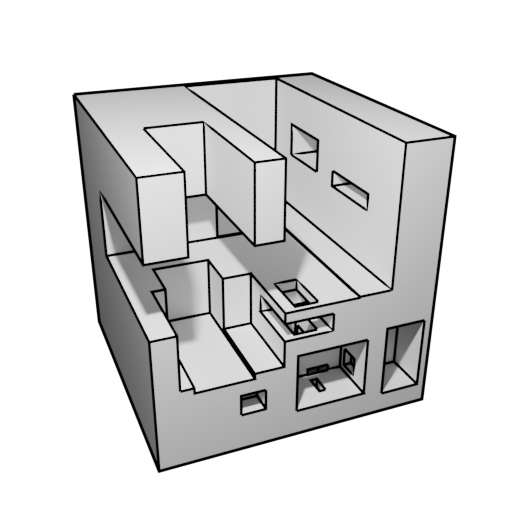

  

  

  

    
    
  

---

  
Banner

  <h2>About Me</h2>
  <h4>
    I am a Student  and work seeking a man from Lithuania, with a big passion for technology that might not change the world, but it might help keep the world stable, at least for now
  </h4>

<lu>
  <li> I’m working as a Front-end developer and learning fundamentals of software engineering in C++.
  <li> My dream is an ability to make drivers for IRL devices. Like Gpu's, Cpu's or 3D printer.
  <li> Moreover, I'm interested in DevOps. Mainly in Linux and making programs work without any errors.<li> In my free time I make music, make games, 3D model and run a small table lamp web shop.
  <li> How to reach me on:
</lu>

  
  

<!-- I am a Full Stack Developer  from India.

- 🔭 I’m working as a Software Engineer and contributing to frontend and backend for building web applications.
- 🌱 Exploring Technical Content Writing.
- ⚡ In my free time I solve problems on GeeksforGeeks and read tech articles.
- 📫 How to reach me: &nbsp;  -->
