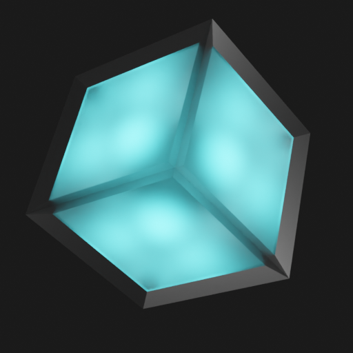

# Hi, I’m Justinas
### About me

I am a coder, but I want to be a C or Rust porgrammer / softwere enginere, or DevOps enginere.

---

- 👀 I’m interested in 3D modeling, C++, Rust. Mainly intresed in low level, BIOS develepment, or just back-end.
- 🌱 I’m currently learning CompTIA A+, programming, codeing, 3D modeling and more.
- 💞️ I’m looking to collaborate on simple software that can improve my programming skills, digital art skills and geass find frends
- 📫 You can reach me on IamJustStan@hotmail.com

<!-- My img -->
<picture>
 <source media="(prefers-color-scheme: dark)" srcset="./1.png">
 <source media="(prefers-color-scheme: light)" srcset="./2.png">
 
</picture>

## My favorit lagviges are in this order

| Number | Langvige   |
|--------|------------|
| 1.     | C/C++      |
| 2.     | Rust       |
| 3.     | JavaScript |
| 4.     | Java       |
| 5.     | CSS        |
| 6.     | Python     |

## At his momnent I am consentriting on fue porjects 

| How ergent is it |        Project name        |
|:----------------:|:--------------------------:|
|         7        |       JustoMetronomas      |
|         5        |     My Persinal Vue.js     |
|         5        |      Three.js WebShop      |
|         3        |     Discord bots in D++    |
|         2        | Discord bots in discord.js |

---

### Biography
I am Justinas. I come from a Europe country Lithuania, I love the look of post Soviet country, something about the depressive look of the *chruščiovkes* ant the mood that it gives to me. Motivation to improve the country.

I like to study new skills like photography, software development, 3d modeling, game development, movie making, digital art, server maintenance and Linux. Specifically **arch** Linux. 

I suck at the usual school system, almost past it, but I like to stay home and learn skills on my one. I can call my self a **Jack of all trades, master of none**. And that's me programmer wanna be.